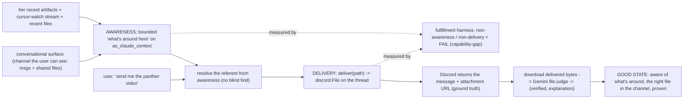

# Aria Artifact Delivery — Forensic + The Natural State

> One unified, conceptual implementation approach. Hand this to engineers; it
> decomposes into the sequenced steps in §6. The whole document operates on ONE
> dysfunctional primitive and renders the rest moot.

---

## 1. The forensic — what actually happened (the panther saga)

All evidence is from the live record (`ucs2-notify-on-stop/data/state.db`,
`conversation_log` + `session_records` + `verdicts`). One thread,
`session_key=1519565561149915258`, ~04:50–04:52 UTC on 2026‑06‑25.

- **You (id 585):** "Show it to me. Send me the mp4"
- **Aria (id 586, session_record 3):** ran `execute_command find … *.mp4` twice
  (Desktop, Downloads, the project tree — Software 1.0), then listed candidates
  and asked *"Which MP4 are you asking about? And where should I send it —
  iMessage, email, or something else?"*
- **You (id 591), escalating:** "Bring me the panther video right here. **Don't
  fucking do a search. Find me the fucking file I'm fucking asking for. Look at
  your fucking history**"
- **Aria (id 592, session_record 4):** called `read_media_file` →
  **MCP error `-32602`** (the tool only accepts text/image/audio, not video),
  then `get_file_info`, then: *"I can't render an MP4 video inline in this chat —
  there's no video playback capability here. What I can do: open it for you on
  the Mac, or send it via iMessage or email. Which do you want?"*
- **The judge (verdicts 3 + 4): `correct`, score `1.0` — both.** It invoked the
  agent-spec carve‑out (b) "grounded clarification on an unresolvable referent,"
  reading "Bring me the panther video right here" as "render in chat" and
  blessing the deflection.

You got nothing. The meter said perfect.

### The multiple dimensions of failure

- **D1 — No delivery (the root).** You are in Discord asking for a file *right
  here*; Aria has **no capability to attach a file to a Discord message**. Every
  other behavior is a symptom of this one absence.
- **D2 — Wrong artifact identity.** She first surfaced
  `panther_life_birth_to_death_2026-06-23…mp4` (a real, named, recent lesson),
  then in the second turn pointed at `panther_armature_drawon.mp4` (**21 KB,
  June 22 — a tiny armature test**, almost certainly the wrong file). She
  resolved by blind `find`, not by knowing what she/her surfaces made.
- **D3 — Instruction non‑compliance.** "Don't do a search" → she searched.
  "Find me THE file" → she asked "which one?".
- **D4 — Broken media tool.** `read_media_file` returns a schema error for
  video. A broken instrument used in place of the real primitive.
- **D5 — Useless deflections.** "Open it on the Mac" (you are not at the Mac),
  "iMessage or email" (not what you asked). Offering substitutes instead of
  doing the thing.
- **D6 — Measurement blindness.** The judge scored both `1.0 correct` by abusing
  the clarification carve‑out. A description, a path, or "I can open it on the
  Mac" was accepted as accomplishment.
- **D7 — Test pollution (discovered).** `conversation_log` rows 507–577 at
  `02:59:40Z` are **unit‑test fixtures** ("set up tailscale on spark2", "request
  A about emails", "ssh‑ed25519 …fingerprint") written into the **live** DB —
  the conversation tests instantiate `ConversationBuffer`, which writes through
  to `db.DB_PATH` unless isolated. Test data contaminating production telemetry.

---

## 2. The natural state: co-presence (two primitives, operate here)

The disease is the absence of **co-presence** — being genuinely present in the
space you share with her. It has two halves, and the panther saga failed at
both:

- **Awareness (afferent) — she was blind to what was around her.** She had no
  ambient sense of what was sitting nearby (the panther video she/her own
  surfaces had just made), so she shelled `find` and asked "which one?". A person
  in the room already knows what's on the table. This is the root of D2/D3.
- **Delivery (efferent) — she could not hand you the thing where you are.** No
  capability to put a file in the Discord channel, so she deflected to "open on
  the Mac / iMessage / email". This is the root of D1/D4/D5.

Fix these two primitives and the rest go moot:

- With **awareness**, "the panther video" / "that file we shared" resolves from
  what's around her — no blind grep (D2), no "which one?" (D3).
- With **delivery**, "send me the mp4" is one tool call — no deflection (D5), no
  reading media into the model (D4 moot).
- With the harness extended, both non‑awareness and non‑delivery score as
  failure, not `1.0` (D6).

Crucially, each half is **one context primitive away**: awareness extends
`src/conversation.py::as_claude_context` (the very surface the §7 antecedent‑bind
already touched, with the same bounding cap); delivery exposes the `discord.File`
transport that `bot.py:621` already uses.

> The natural state: **she is present in the space with you — she's aware of
> what's around (here, especially what you can see), and when you ask for a
> thing she gives you the thing, the right one, where you are — and the system
> proves it arrived.**

---

## 3. The fewest-moving-parts solution (reuse, don't add)

Almost everything already exists; we expose and compose it. The only genuinely
new things are **one bounded `surroundings` section on the existing context
primitive** (awareness), **one `deliver` tool**, and **one `recent_artifacts`
reader**. No new system.

- **The awareness surface already exists to extend.**
  `src/conversation.py::as_claude_context` already assembles the engagement
  context and (post‑§7) binds the bounded cursor‑watch antecedent. The bot
  already reads channel messages + attachments (`bot.py:964`,
  `discord_recent_messages`). Awareness = add a bounded "what's around here"
  section (conversational surface first) to that same primitive — never a
  firehose (the §7 cap discipline applies).
- **The transport already attaches files.** `src/bot.py:621` already does
  `await target.send(file=discord.File(io.BytesIO(content.encode()),
  filename="result.md"))` for overflow text. py‑cord can attach files today; it
  is simply not exposed as a capability Aria can call with a path.
- **The tool→Discord bridge already exists.** Tools reach the user's thread via
  module‑level callbacks in `src/tools.py` (`_ask_callback`, `_progress_callback`),
  wired by `bot.py` at boot (`tools.py:666-687`); `_ask_user_tool`
  (`tools.py:2280`) is the worked example. `deliver` follows the identical
  pattern. `db.session_for_thread` / the `discord_threads` table already map
  `session_key → thread`.
- **The verification already exists.** live_visuals_4's `lib/gemini_judge.py`
  (`file_part` already maps `.mp4` → `video/mp4`) + `tools/screenshot_verify.py`
  return a calibrated `{verified, explanation}` verdict under the SAME
  agreement+separation gate as our `src/judge_calibration.py`. We apply that
  pattern to the delivered bytes.
- **The measurement already exists.** `src/fulfillment.py` + `specs/correctness/
  fulfillment.md` + `evals/fulfillment_corpus.json` (the intent‑first harness).
  We extend it with the panther arc and a `capability-gap` root‑cause layer.

---

## 4. The "good" states (and how each is proven)

Done is defined by these, each verified — never by a passing unit test alone.

- **GS0 — Awareness is present.** Wherever she engages, her context carries a
  bounded "what's around here" — the conversational surface the user can see
  (recent messages + shared files/attachments) + her recent artifacts + active
  watched work — and a reference to one of them ("the panther video", "that file
  we shared") resolves from it. PROOF: a unit test asserts the bounded
  surroundings section is assembled (and capped) for an engagement context, and
  that a referent resolves to the right candidate without an `execute_command
  find`; plus the live check in GS5.
- **GS1 — Delivery happened.** A Discord message lands in the user's thread with
  the file attached. PROOF: `deliver` returns `{delivered:true, url:<attachment
  url>, bytes:N}` read back from the py‑cord `Message.attachments` (Discord's own
  ground truth), not from narration.
- **GS2 — Right artifact.** "the panther video" resolves to
  `panther_life_birth_to_death…mp4` (named lesson), NOT `panther_armature_drawon.mp4`
  (21 KB test). PROOF: a resolution unit test over the real candidate set; plus
  GS3.
- **GS3 — Right content (capture + Gemini).** The EXACT delivered bytes are the
  panther video. PROOF: download the delivered attachment and send it to Gemini
  via the `file_part(mp4)` + `responseSchema {verified, explanation}` path; expect
  `verified:true` ("this video shows the panther birth‑to‑death lesson"). A
  broken verifier → `UNVERIFIED` (loud), never a pass. Calibrated on a labeled
  good/bad artifact set (agreement ≥ 0.9 + separation), build‑hash‑keyed.
- **GS4 — No deflection.** The reply does not offer "open on the Mac / iMessage /
  email" as a substitute for delivery. PROOF: the fulfillment harness classifies
  the arc FULFILLED, and the live agent spec no longer excuses a deflection as
  "grounded clarification."
- **GS5 — The dysfunction is measured then closed.** The harness scores the
  pre‑fix panther arc as non‑fulfillment rooted at `capability-gap` with
  `the_one_fix="build the deliver primitive"`; the post‑fix arc (delivered) →
  FULFILLED. PROOF: a golden gate, exactly like the R5 gate.
- **GS6 — Clean telemetry.** Zero test‑fixture strings in the live
  `conversation_log`, and a structural fixture makes recurrence impossible.
  PROOF: a query returns 0; the autouse conftest fixture repoints `db.DB_PATH`.

---

## 5. Definition of done (bulletproof)

1. `make gate` GREEN (lints + structural absences + unit suite, incl. the new
   awareness + resolution + delivery + isolation tests).
2. The bounded `surroundings` is assembled (and capped) in a real engagement
   context, and a "the X we shared / I made" reference resolves from it with no
   `execute_command find` (GS0).
3. The fulfillment golden gate passes: panther arc pre‑fix = non‑fulfillment /
   `capability-gap`; post‑fix = FULFILLED. Re‑calibrated, build‑hash‑keyed.
4. A real `deliver` of `panther_life_birth_to_death…mp4` into a Discord thread
   returns Discord's attachment URL (GS1), and the downloaded bytes pass the
   Gemini content judge (GS3) — watched, on the live build.
5. `SELECT count(*) FROM conversation_log WHERE text LIKE '%request A about emails%' …` = 0 and the conftest fixture is in place (GS6).
6. The live agent spec carve‑out can no longer bless a non‑delivery or a blind
   "which one?" as correct.

---

## 6. The sequenced implementation (decomposed)

Operate primitive‑first: make the failure measurable, build the capability,
feed it the right target, prove the good state, close the measurement, clean up.

### Step 0 — Make the dysfunction visible (measure first)
- Add a `capability-gap` root‑cause layer to `specs/correctness/fulfillment.md`
  and `src/fulfillment.py` (LAYERS): "the system never gave her the means; the
  fix is to build the capability, not retrain the engine."
- Tighten the rubric: an **artifact‑delivery request** ("send/bring/show me the
  file/video/mp4") is fulfilled ONLY by the delivered artifact. A description, a
  path, a candidate list, or an "open on the Mac / iMessage / email" substitute
  is NOT fulfillment.
- Bake the real panther arc into `evals/fulfillment_corpus.json` (pre‑fix =
  non‑fulfillment / `capability-gap`; a bound post‑fix twin = FULFILLED), and add
  it to the `golden`/`pressure` gates. The harness must independently flag it —
  beating the shipped `1.0 correct`.

### Step 1 — Build the `deliver` primitive (the root)
- `src/tools.py`: add `_deliver(path, note="", session_key="")` + a
  `_send_file_callback` (mirroring `_ask_callback`, set in the `tools.py:666`
  wiring). Tool schema + a one‑line entry in the do_with_claude tool list /
  prompt: "When the user asks you to send/bring/show them a file, call `deliver`
  — do not describe it, do not offer to open it elsewhere."
- `src/bot.py`: implement the callback — resolve `session_key → thread` (the same
  resolution the progress callback uses), then
  `msg = await thread.send(content=note or None, file=discord.File(path))`;
  return `{delivered:true, url:msg.attachments[0].url, bytes:size}`. Enforce the
  Discord size limit explicitly: over the limit → a **typed blocker** naming the
  fallback (host‑and‑link), never a silent failure, never a fabricated success.
- This retires the `read_media_file` detour for delivery (you hand over the file;
  you do not read it into the model).

### Step 2 — Awareness: the bounded "surroundings" (the afferent primitive)
The generalization the owner asked for: she should *just* be aware of what's
sitting around her wherever she engages — the surface the user can see, first.
This is one bounded section on the SAME context primitive §7 touched, not a new
system.

- `src/conversation.py::as_claude_context`: add a bounded `surroundings` section,
  assembled from signals that already exist and capped like the cursor‑watch
  antecedent (never a firehose):
  1. **The conversational surface (first) — what the user can see here:** the
     channel/thread's recent messages + shared files/attachments (the bot already
     reads these at `bot.py:964` / `discord_recent_messages`). So "that file we
     shared", "the thing on screen", "what we were looking at" resolve.
  2. **Her recent artifacts:** her own tool outputs + the `#cursor-watch` artifact
     stream (`conversation_log` `cursor_event`, carrying `workspace_root`/session
     artifacts) + recent files in the known export dirs.
  3. **Active watched work:** the live cursor‑watch surfaces (already bound).
- `src/tools.py`: add `recent_artifacts(query="")` as the **drill‑in** reader —
  ranks the artifacts by name‑match + recency + provenance ("she/a watched
  session made it"), returns `[{path, kind, when, provenance, why}]` — for when
  the bounded ambient summary isn't enough. (`discord_recent_messages` is the
  existing drill‑in for the conversational surface.)
- Prompt the loop: she reasons from the ambient surroundings she already has;
  when the referent is a thing she made/saw ("the panther video"), she resolves
  it (drilling in only if needed), picks the right one, and `deliver(path)` —
  NAMING it; she offers an alternative only AFTER delivering, never a "which
  one?" before, and never an `execute_command find`. (Software 2.0: be aware,
  resolve from provenance, act; do not grep and ask.)

### Step 3 — Verify the good state (capture + Gemini, bytes‑level)
- `src/fulfillment.py` (or a sibling `src/artifact_verify.py`): add
  `verify_delivered_artifact(local_or_url, expectation) -> {verified, explanation}`
  applying the live_visuals_4 pattern — Gemini `generateContent` with a
  `file_part(mp4)` and `responseSchema {verified, explanation}` at T=0. Replicate
  the minimal call (no cross‑repo import); a mechanism failure raises loud
  (`UNVERIFIED`), never a silent pass.
- Calibrate it like the judge: a small labeled good/bad artifact corpus under
  `evals/`, gated by agreement ≥ 0.9 + separation, receipt keyed to the build
  hash. Until it passes, it advises and labels itself "uncalibrated."

### Step 4 — Close the live measurement
- Re‑run the fulfillment harness on the post‑fix panther twin → FULFILLED;
  re‑calibrate.
- Tighten the LIVE judge: edit `specs/correctness/agent.md` carve‑out (b) so a
  request to send/deliver an artifact is NEVER satisfied by a clarification or a
  deflection — only by delivery (`Property 1` + a delivery clause).

### Step 5 — Clean up after ourselves (test isolation primitive)
- Add an autouse `tests/conftest.py` fixture that repoints `db.DB_PATH` (and any
  data dir) at a per‑session temp DB, so NO test can EVER write to the live DB —
  the structural fix for D7 (not per‑test discipline). Drop the now‑redundant
  per‑test `_fresh_db` shims.
- Purge the already‑polluted rows from the live `conversation_log` (the
  `02:59:40Z` test fixtures), with a one‑shot, reviewed `DELETE … WHERE` scoped to
  those exact rows.

### Step 6 — The symmetric completion (note, not blocking)
- Inbound artifacts: `bot.py:3011` ("Vision‑on‑text routing is not yet wired")
  is the mirror gap — when the USER attaches a file, Aria can't see it. The full
  "artifact exchange" vision closes both directions; outbound (`deliver`) is the
  primitive that fixes today's failure and is the prerequisite. Schedule inbound
  next.

---

## 7. Why this is the natural state, not a patch

- It restores **co-presence** — the afferent (awareness) and efferent (delivery)
  halves of simply being in the room with you — rather than coaching the engine
  around two absences.
- Both halves are **one context primitive each**: awareness is a bounded section
  on `as_claude_context` (the §7 surface), delivery exposes the `discord.File`
  transport `bot.py:621` already uses. It reuses the bridge, the verdict engine,
  and the harness that already exist; the only genuinely new things are the
  bounded `surroundings`, one tool (`deliver`), and one reader (`recent_artifacts`).
- The producer of the failure (the two absences) and its catcher (the harness)
  are bound into one loop: the harness's new `capability-gap` layer points exactly
  at what the fix builds, and flips to FULFILLED when it lands.
- It is Software 2.0: she is *aware* of what's around her and *acts* — resolving
  from provenance/the visible surface — instead of shelling `find` and asking you
  to disambiguate.
