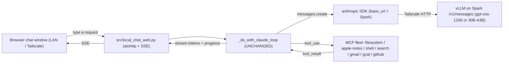

# Local Spark Agent — a local-brained chat window over the existing loop

A browser chat window on your LAN/Tailscale where you type requests and Aria's
**existing** agent loop + MCP fleet (search, notes, filesystem, shell, mail,
calendar, GitHub) answers them — but the **brain runs locally on the DGX Spark**
(an open-source model), not cloud Claude.

This is the engineer-facing reference for what was built. The design rationale
lives in the chat plan; the system map lives in
[`ARCHITECTURE.md`](../ARCHITECTURE.md) (see the "Local Spark Agent" capability)
and [`ops/spark/NODES.md`](../ops/spark/NODES.md) §9.

## The one idea (operate on the primitive)

The dysfunctional primitive was **a remote, metered, cloud-bound brain**. Nothing
else needed to change: the single agent loop (`tools._do_with_claude_loop`), the
MCP fleet, ground/findings/outcomes/anchors, and verified-done already run
locally. We **relocated the brain** and **added a transport** — nothing more.

Two facts made it nearly free:

- **vLLM serves the Anthropic Messages API natively** (`/v1/messages`). The loop
  calls `_anthropic_client.messages.create(...)` and reads `tool_use` blocks,
  `stop_reason`, and `usage`. Pointed at a vLLM `base_url`, that call is
  **unchanged** — no proxy, no LiteLLM, no provider seam, no second loop.
- The transport is the existing `aiohttp` pattern (`src/cursor_external.py`) and
  the no-Discord entry-point pattern (`src/local_voice.py`).

So the entire change is: **(1)** serve a model on the Spark behind `/v1/messages`,
**(2)** make the brain a per-process config (`ANTHROPIC_BASE_URL` + model name),
**(3)** add a browser chat transport that drives the same loop, **(4)** prove
every good state with the capture+Gemini harness we already own.



## The routing seam (one knob)

- `src/config.py` → `brain_base_url` (`ANTHROPIC_BASE_URL`). Empty = cloud Opus
  (the main Discord/voice bot); set = the Spark. The SDK honors the env var
  natively; the field makes it observable to a probe.
- `src/tools.py::init_tools` constructs the Anthropic client with
  `base_url=config.brain_base_url or None` (dummy key when local).
- `src/preflight.py::probe_anthropic` uses the same seam; `probe_local_brain`
  does a real `tool_use` round-trip against the Spark (skipped when unset).

No `ModelRouter`, no flag — brain selection is a `base_url`, per process. The
removed `src/ucs.py` router and a `fallback_to_cloud` anti-pattern are both
ledgered absent in `configs/structural_absences.json`.

## Components

- **Serving (node):** `ops/spark/serve_model.sh` — idempotent `start|stop|status|
  health|logs`. vLLM under tmux (user-level uv venv) or the NGC container
  (auto-detected). `--restart no` on the container (halt-don't-heal).
- **Serving (Mac orchestration + serve-gate asserts):** `src/spark.py` serve
  section (`serve_start/stop/status`, `serve_endpoint`, `messages_payload_*`,
  `assert_serve_*`).
- **Serve acceptance + model bench:** `scripts/spark_serve.py`.
- **Chat transport + UI:** `src/local_chat_web.py` (aiohttp + SSE + one-file UI).
- **Web-UI acceptance:** `scripts/local_chat_gate.py`.
- **Runtime receipt:** `scripts/live_meter.py --base-url`.
- **Search:** a web-search MCP (`search`) auto-registered in `src/mcp.py` when
  `BRAVE_API_KEY` or `TAVILY_API_KEY` is set (+ `probe_mcp_search`).

## Run it

```bash
# 1. Serve a model on the Spark and wait until healthy (default: gpt-oss-120b).
make spark-serve                      # = scripts/spark_serve.py --node spark1 --start

# 2. Prove the serve good states twice (machine + Gemini screenshot).
make spark-serve-verify               # server up, chat, TOOL_USE round-trip, cache_control, GPU

# (optional) Bench both candidates and get a recommended default.
make spark-serve-bench

# 3. Certify a real request fires a real tool on the LOCAL brain.
make meter-local                      # writes data/receipts/<build_hash>.local.json

# 4. Open the chat window (resolves the Spark endpoint for you).
make local-chat                       # http://localhost:8742/  (Ctrl+C to exit)

# 5. Prove the web UI end-to-end (browser screenshot + Gemini).
.venv/bin/python scripts/local_chat_gate.py

# Teardown (weights cache kept):
make spark-serve-stop
```

Reach it from your phone over Tailscale: set `LOCAL_CHAT_HOST=0.0.0.0` and a
strong `LOCAL_CHAT_SECRET` (the server refuses a non-loopback bind without one),
then open `http://<mac-tailscale-ip>:8742/` and enter the secret in the header.

## Good states (each proven twice, the way everything here is proven)

- **Serving up** — `/v1/models` lists `local-brain`; GB10 shows weights resident.
- **Tool-call round-trip** (the #1 OSS risk) — `/v1/messages` with a tool returns
  a parseable `tool_use` block AND `stop_reason="tool_use"`. The model+`--tool-
  call-parser` combo that fails this cannot run the loop; the bench picks one that
  passes (gpt-oss `openai`, Qwen3 `hermes`).
- **cache_control tolerance** — vLLM accepts the exact `cache_control:ephemeral`
  blocks the loop emits (HTTP 200).
- **Routing** — the SDK at `base_url=Spark` returns a `tool_use` (`probe_local_brain`).
- **Agent (the real done)** — a real `do_with_claude` request fires a real MCP
  tool and answers without walling (`live_meter --base-url`, `tool_fired=true`).
- **Web UI** — a typed request renders a tool-backed answer in the browser
  (`local_chat_gate.py`: machine `/last` + Gemini screenshot).
- **Halt, don't heal** — brain down ⇒ the chat refuses to start with the fix; no
  cloud fallback.

## Notes / risks

- **Single-node, independent-worker only.** The 2-node cluster link is power-
  throttled (NODES.md §9); distributed inference is out of scope.
- **Cost accounting goes to ~0** for the local surface (vLLM reports input/output
  tokens only; the loop's `getattr(usage, …, 0)` degrades cleanly). The local
  brain is free; the daily cap is a no-op there.
- **Privilege:** docker is present on the nodes (container engine works); the
  user-level uv-venv engine is the least-privilege alternative (NODES.md §3).
